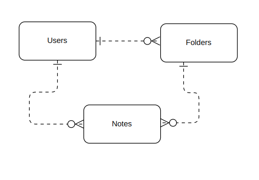

# NotesServer

### Backend for Google Docs Style Notes Client App:
https://github.com/tzou2024/noteclient

### Django Backed

## Routes:

| Route | Description |
| ----| ----|
| /  | allows users to see all notes and folders|

| Route | Description |
| ----| ----|
| /sign-up | allows users to create a new account |
| /sign-in | allows users to sign into their account |
| /change-password/ | allows users to change their password |

| Route | Description|
| -------- | ------|
| /notes/  | all of user's notes|
| /notes/\<noteId>/ | individual note

| Route | Description|
| -------- | ------|
| /notes/  | all of user's folders|
| /notes/\<noteId>/ | individual folder and all notes that belong to that folder

------
### ERD

